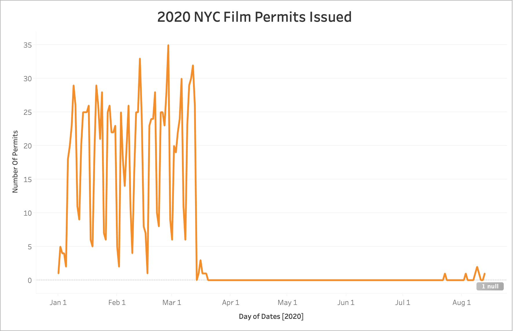
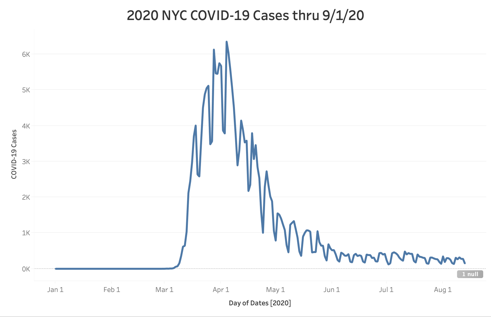
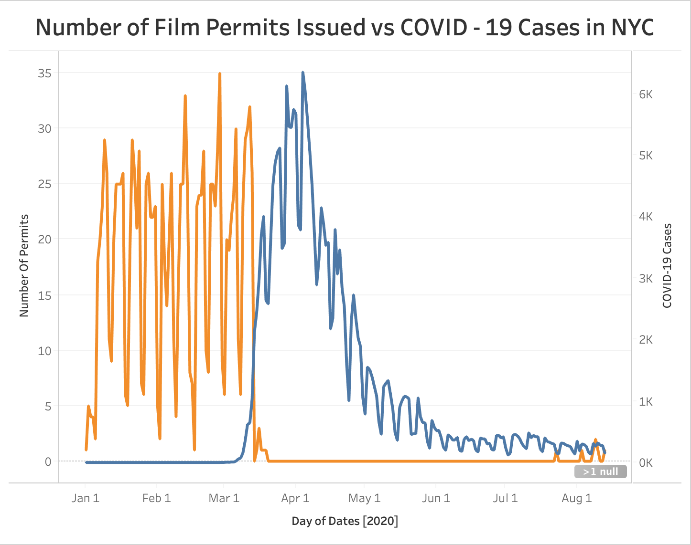

# 626 Project
### Analyzing the effects of COVID-19 on film permits issued in NYC.

* Initial Question
- Many industries took a hit during the covid-19 pandemic. One industry that especially took a large hit was the film industry. Production all over the country was delayed as it requires large film crews to make a film work. One of the most popular places in the world to film is NYC. For my project I would like to look at open NYC data set for 'Film Permits' and compare that dataset with the 'Covid 19 Daily Count of Cases, Hospitalization, and Deaths' dataset and see if there is a connection between what I presume is to be less film permits while the number of Covid cases rise. This is obviously a very rough outline for what I intend to do with my final project, but I would like to hear your input to see if this is a reasonable project idea. I have an idea what story the data might tell, but like you said a lot of this class deals with the preprocessing and cleaning of data and I think these datasets could offer that.

### Outline

- Downloaded the datasets 'COVID-19 Daily Counts of Cases Hospitalizations and Deaths' and 'Film Permits' from the website NYC Open Data
- Created subsets of each dataset with the columns of data that I needed to access.  
      - For film permit subset just included 2020 data since virus data did not start until 2/29/2020
- Merged the two csv files
- Created dictionary to see number of permits issued each date
      - Created new subset which I was able to merge into csv file that I could compare the total number of permits issues each day compared to the number of virus cases each day
- Wanted to make dictionary with dates from 1/1/2020 to 9/1/2020 returning values of number of cases and permit for each day

### Results

* From 1/1/2020 NYC issued on average approximately 19 film permits per day. No day had less than 1 permit issued until 3/14/2020 where 0 permits were issued. On 3/20/2020 the Mayor's Office of Film, Theatre & Broadcasting stopped issuing permits out until 7/23/2020. No more than 2 permits have been issued since.

* No cases were reported until 2/29/2020. On 3/14/2020, the date when the permit office had the first day in 2020 that they did not issue a single permit, COVID-19 cases doubled the previous high total. On 7/23/2020, the first permit in 4 months was issued on one of the lowest total number of cases since the inception of the virus.

* Graph shows the relationship between the number of film permits issued and number of COVID-19 cases. As the amount of virus cases rise the number of permits issued by NYC declined. It appears to be an inverse relationship.

### Summary

* One of the requirements for the assignment was to join the two datasets we worked with. Both datasets deal with data from NYC, but my data was joined on the datetime. Each data set followed a '%m/%d/%Y %H:%M:%S %p or %a' format. Found %p or %a format did not matter as both times were included in the strftime change. However, even though both datasets were in datetime the granularity was different. For 'Film Permits' it was recorded down to the hour, where the hours and minutes were zero padded. It was necessary for me to make sure both datasets were zero padded on the hours and minutes as I was just trying to compare the data for an entire day rather than down to the hour.
* I found creating subsets were useful for me as the original datasets were much larger. The 'Film Permits' dataset dealt with almost 10 years of film permits, but for the purpose of my project analysis I only had to compare a few months since the 'COVID-19 Daily Counts of Cases Hospitalizations and Deaths' dataset is relatively new. By breaking the data down by year and time I was able to find the number of instances for film permits each day and eventually create a csv file where I could compare the data of both sets by day.
* I was able break each dataset down to return a date and number of permits corresponding to that day or a date and number of cases for that day, but I was unable to create a dictionary with the date as a key that returned both cases and permit values. In the 'Film_Permit' dataset, records completely stopped when pandemic shut down the NYC film industry. Going into the project, I was unaware that permits were completely shut down for a substantial amount of time, so there were only a handful of dates that the recorded data for both permits and cases. Creating a dictionary as such would have been a good representation to show how the data overlapped on certain dates. 
